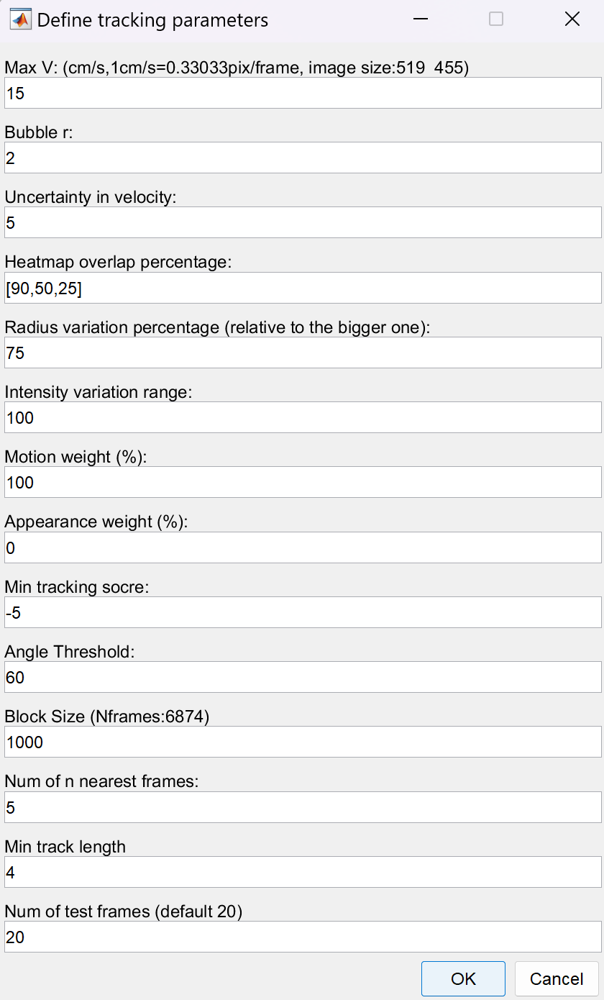
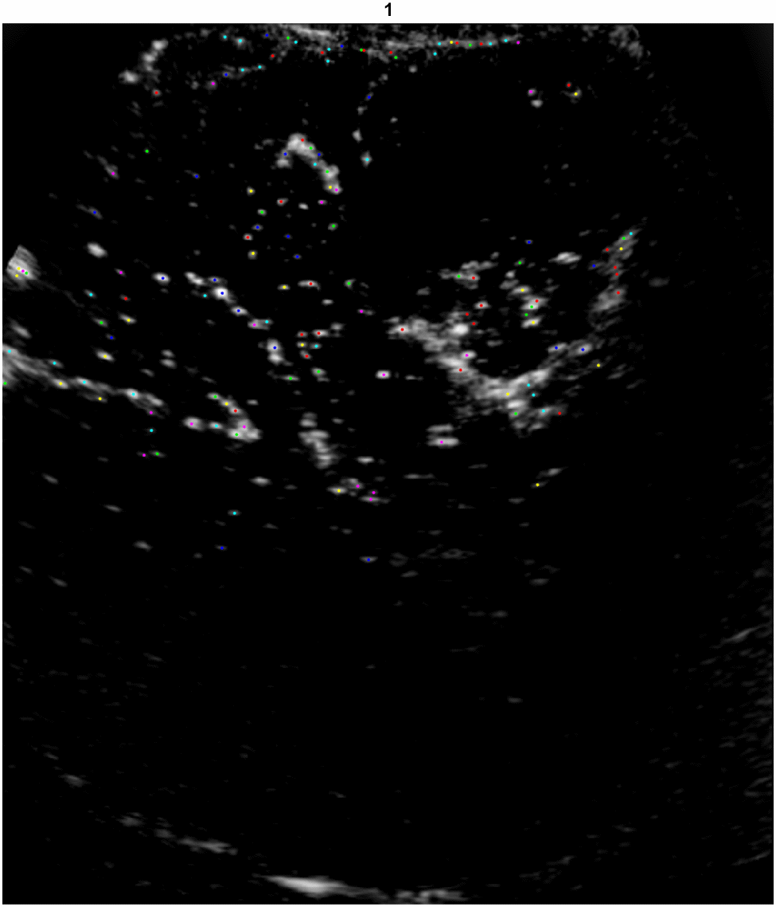

# ULM-tracking
Example for efficient microbubble tracking algorithm in Ultrasound localization microscopy (ULM).

---

### Data discription

#### contrast enhanced ultrasound images

The CEUS (Contrast Enhanced Ultrasound) data contains preprocessed ultrasound imaging sequences stored in the `data\ceus` directory. 

```text
data/
└── ceus/
    └── *.bin          # Preprocessed CEUS image sequences (binary format)
```

---

#### sI_t

The `sI_t` variable contains microbubble detection and tracking information organized as a cell array. Each cell contains an $N \times 8$ matrix where each row represents a detected microbubble with the following column structure:

| Column | Parameter        | Description                                                  |
| :----- | :--------------- | :----------------------------------------------------------- |
| 1      | **Area**         | Microbubble area in pixels (can be set to 1 if not available) |
| 2      | **Perimeter**    | Microbubble perimeter in pixels (can be set to 1 if not available) |
| 3      | **X-coordinate** | Sub-pixel X-coordinate of microbubble centroid               |
| 4      | **Y-coordinate** | Sub-pixel Y-coordinate of microbubble centroid               |
| 5      | **Track ID**     | Unique identifier assigned by the tracking algorithm (0 if not tracked) |
| 6      | **Intensity**    | Normalized intensity value of the microbubble                |
| 7      | **Bubble ID**    | Sequential bubble identifier within the current frame        |
| 8      | **Frame Number** | Source frame number from which the microbubble was detected  |

**Example Data Format:**

```text
sI_t{1} = [
    49    28    58.1231    221.7184    0    0.3828    39    1
    49    28    58.8642    176.8874    0    0.4281    40    1
    49    28    60.4284     82.2404    0    0.2014    41    1
    ...
]
```

---

#### Tracking Parameters: PTVPara

The `PTVPara` structure contains all the configurable parameters for the microbubble tracking algorithm. These parameters control various aspects of the particle tracking velocimetry (PTV) process:



| Parameter                | Variable        | Default Value      | Description                                                  |
| :----------------------- | :-------------- | :----------------- | :----------------------------------------------------------- |
| **Max Velocity**         | `maxV`          | 15                 | Maximum expected velocity in cm/s (can be converted to pixels/frame based on `pixdis/fps`) |
| **Bubble Radius**        | `bblR`          | 2                  | Expected microbubble radius in pixels for detection          |
| **Velocity Uncertainty** | `sigmaV`        | 5                  | Uncertainty in velocity estimation for Kalman filter (affects prediction accuracy) |
| **Heatmap Overlap**      | `ovlppct`       | [90 50 25]         | Overlap percentage thresholds for heatmap-based tracking at different search levels |
| **Radius Variation**     | `dRpct`         | 75                 | Maximum allowed radius variation percentage (relative to the larger bubble in comparison) |
| **Intensity Variation**  | `dI`            | 100                | Maximum allowed intensity variation percentage between frames |
| **Motion Weight**        | `wMtn`          | 100                | Weight assigned to motion-based similarity in tracking cost function (%) |
| **Appearance Weight**    | `wApp`          | 0                  | Weight assigned to appearance-based similarity in tracking cost function (%) |
| **Min Tracking Score**   | `minScore`      | -5                 | Minimum tracking score threshold for accepting a link between bubbles |
| **Angle Threshold**      | `angleThres`    | 60                 | Maximum angle difference (degrees) allowed between motion vectors of three consecutive frames |
| **Block Size**           | `blockSize`     | min(1000, Nframes) | Number of frames processed in each block (memory management) |
| **Nearest Neighbors**    | `nNearest`      | 5                  | Number of nearest neighbor bubbles to consider in adjacent frames |
| **Min Track Length**     | `minTrjLen`     | 4                  | Minimum number of detections required to form a valid trajectory |
| **Test Frames**          | `numTestFrames` | 20                 | Number of frames used for testing trajectory quality         |

---

### Track-test result

In the test case, we track for 20 consecutive frames and save the result as gif in `imgs` folder.



If `PTVParas` are suitable for tracking, then you can run for all frame tracking. The results will be saved in `trackRes.mat`.

---

Note: The `.mat` files in this repository are stored using **Git LFS** (Large File Storage). If you download the repository as a ZIP file directly from GitHub (e.g., via the "Download ZIP" button), these files will only appear as small placeholder files (around 1 KB), containing metadata instead of the actual data.

To get the full files, please **clone the repository using Git with LFS support**. For more details, see: [https://git-lfs.com](https://git-lfs.com/). Alternatively, you can view and download individual `.mat` files directly from the GitHub website by navigating to the specified file and clicking **"Download"** which may provide the full content.

---

If you have some problems or can not run successfully in `main` function, please email: wangwx2024@shanghaitech.edu.cn. For full access to the code or any permissions, please contact the corresponding author email: zhangzeng@shanghaitech.edu.cn.

 
